### "60 days of Udacity" daily posts

[D_13](https://bertelsmanncloud.slack.com/archives/CRDMQ3H32/p1577226352239000?thread_ts=1577226352.239000)
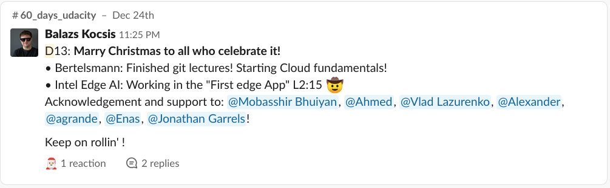

[Day_12](https://bertelsmanncloud.slack.com/archives/CRDMQ3H32/p1577055102312700)
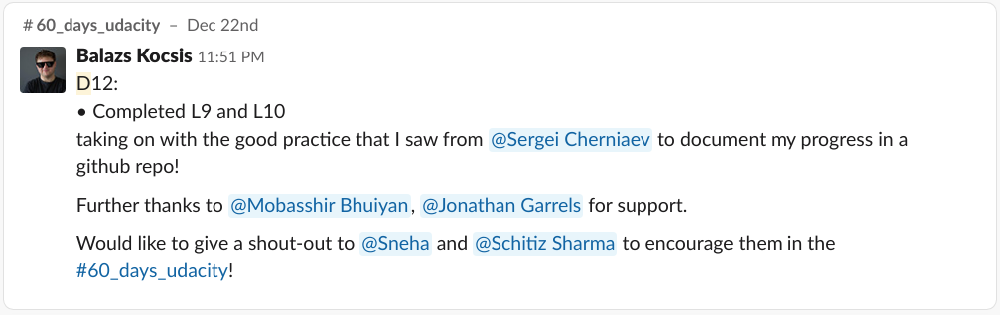

[Day 11](https://bertelsmanncloud.slack.com/archives/CRDMQ3H32/p1576968648373100?thread_ts=1576968648.373100)

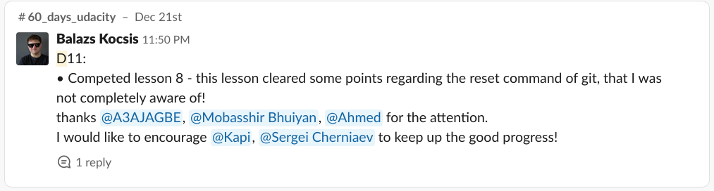

[Day 10](https://bertelsmanncloud.slack.com/archives/CRDMQ3H32/p1576880366416300?thread_ts=1576880366.416300)
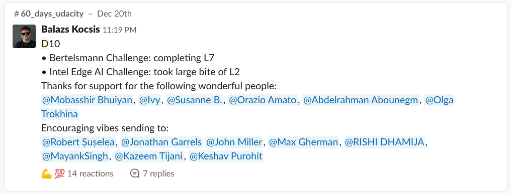

[Day 9](https://bertelsmanncloud.slack.com/archives/CRDMQ3H32/p1576775047274600?thread_ts=1576775047.274600)
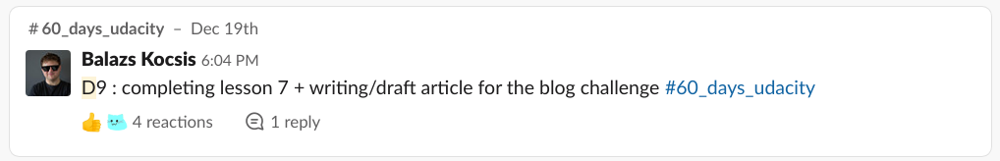

[Day 8](https://bertelsmanncloud.slack.com/archives/CRDMQ3H32/p1576682275082100?thread_ts=1576682275.082100)
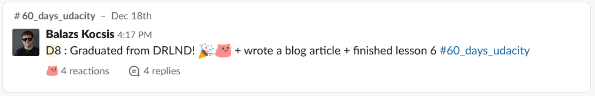

[Day 7](https://bertelsmanncloud.slack.com/archives/CRDMQ3H32/p1576534492401100)
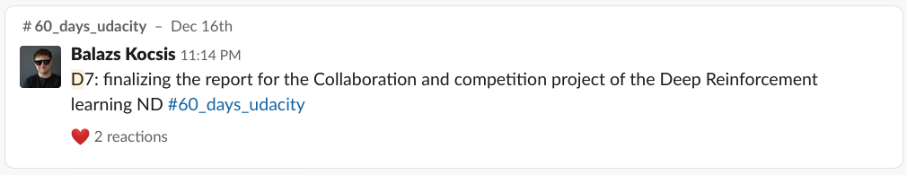

[Day 6](https://bertelsmanncloud.slack.com/archives/CRDMQ3H32/p1576449530461100?thread_ts=1576449530.461100)
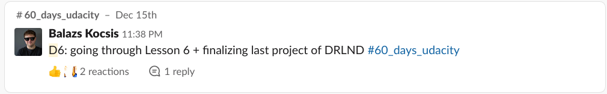

Day 5
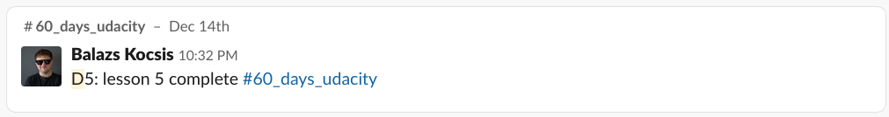

Day 4
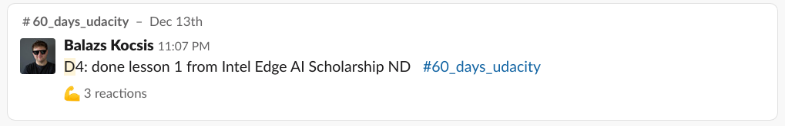

Day 3
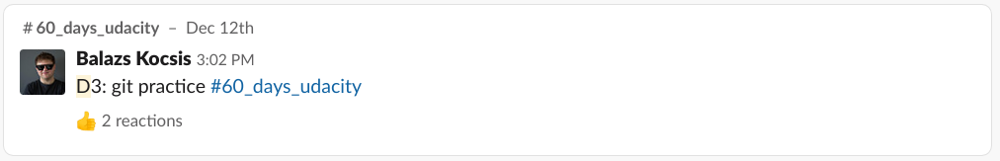

Day 2
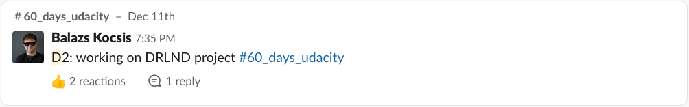

Day 1
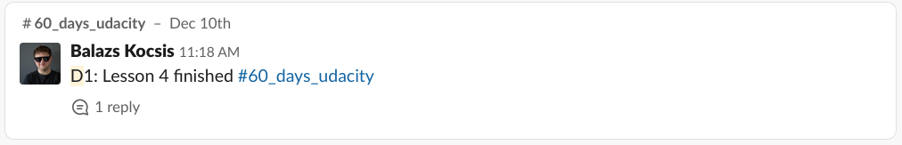
