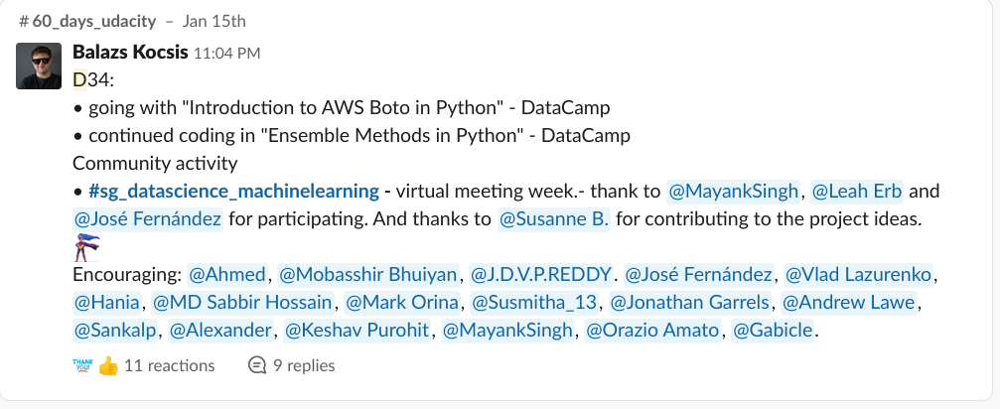
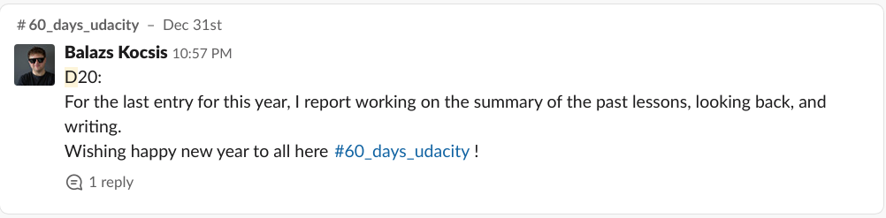

### "60 days of Udacity" daily posts

[D_40](https://bertelsmanncloud.slack.com/archives/CRDMQ3H32/p1579992238045100?thread_ts=1579992238.045100)

[D_39](https://bertelsmanncloud.slack.com/archives/CRDMQ3H32/p1579819678071200?thread_ts=1579819678.071200)

[D_38](https://bertelsmanncloud.slack.com/archives/CRDMQ3H32/p1579646312083400?thread_ts=1579646312.083400)

[D_37](https://bertelsmanncloud.slack.com/archives/CRDMQ3H32/p1579540642238400?thread_ts=1579540642.238400)

[D_36](https://bertelsmanncloud.slack.com/archives/CRDMQ3H32/p1579388018189400)

[D_35](https://bertelsmanncloud.slack.com/archives/CRDMQ3H32/p1579281177309700?thread_ts=1579281177.309700)

[D_34](https://bertelsmanncloud.slack.com/archives/CRDMQ3H32/p1579125851327400)

[D_33](https://bertelsmanncloud.slack.com/archives/CRDMQ3H32/p1579041986293900?thread_ts=1579041986.293900)

[D_32](https://bertelsmanncloud.slack.com/archives/CRDMQ3H32/p1578956316143700?thread_ts=1578956316.143700)

[D_31](https://bertelsmanncloud.slack.com/archives/CRDMQ3H32/p1578869858034200?thread_ts=1578869858.034200)

[D_30](https://bertelsmanncloud.slack.com/archives/CRDMQ3H32/p1578782965397600)

[D_29](https://bertelsmanncloud.slack.com/archives/CRDMQ3H32/p1578696391323700?thread_ts=1578696391.323700)

[D_28](https://bertelsmanncloud.slack.com/archives/CRDMQ3H32/p1578610641268700?thread_ts=1578610641.268700)

[D_27](https://bertelsmanncloud.slack.com/archives/CRDMQ3H32/p1578523784028100?thread_ts=1578523784.028100)

[D_26](https://bertelsmanncloud.slack.com/archives/CRDMQ3H32/p1578435713250300?thread_ts=1578435713.250300)

[D_25](https://bertelsmanncloud.slack.com/archives/CRDMQ3H32/p1578263911128300)

[D_24](https://bertelsmanncloud.slack.com/archives/CRDMQ3H32/p1578178297413400?thread_ts=1578178297.413400)

[D_23](https://bertelsmanncloud.slack.com/archives/CRDMQ3H32/p1578090718252100?thread_ts=1578090718.252100)

[D_22](https://bertelsmanncloud.slack.com/archives/CRDMQ3H32/p1578005675090900?thread_ts=1578005675.090900)

[D_21](https://bertelsmanncloud.slack.com/archives/CRDMQ3H32/p1577919287447400?thread_ts=1577919287.447400)

[D_20](https://bertelsmanncloud.slack.com/archives/CRDMQ3H32/p1577829437423100?thread_ts=1577829437.423100)

[D_19](https://bertelsmanncloud.slack.com/archives/CRDMQ3H32/p1577733599183900?thread_ts=1577733599.183900)

[D_18](https://bertelsmanncloud.slack.com/archives/CRDMQ3H32/p1577660105267300?thread_ts=1577660105.267300)

[D_17](https://bertelsmanncloud.slack.com/archives/CRDMQ3H32/p1577573860252500?thread_ts=1577573860.252500)

[D_16](https://bertelsmanncloud.slack.com/archives/CRDMQ3H32/p1577487469212700?thread_ts=1577487469.212700)

[D_15](https://bertelsmanncloud.slack.com/archives/CRDMQ3H32/p1577401161229700?thread_ts=1577401161.229700)

[D_14](https://bertelsmanncloud.slack.com/archives/CRDMQ3H32/p1577314720263200)

[D_13](https://bertelsmanncloud.slack.com/archives/CRDMQ3H32/p1577226352239000?thread_ts=1577226352.239000)

[Day_12](https://bertelsmanncloud.slack.com/archives/CRDMQ3H32/p1577055102312700)

[Day 11](https://bertelsmanncloud.slack.com/archives/CRDMQ3H32/p1576968648373100?thread_ts=1576968648.373100)

[Day 10](https://bertelsmanncloud.slack.com/archives/CRDMQ3H32/p1576880366416300?thread_ts=1576880366.416300)

[Day 9](https://bertelsmanncloud.slack.com/archives/CRDMQ3H32/p1576775047274600?thread_ts=1576775047.274600)

[Day 8](https://bertelsmanncloud.slack.com/archives/CRDMQ3H32/p1576682275082100?thread_ts=1576682275.082100)

[Day 7](https://bertelsmanncloud.slack.com/archives/CRDMQ3H32/p1576534492401100)

[Day 6](https://bertelsmanncloud.slack.com/archives/CRDMQ3H32/p1576449530461100?thread_ts=1576449530.461100)

Day 5

Day 4

Day 3

Day 2

Day 1

